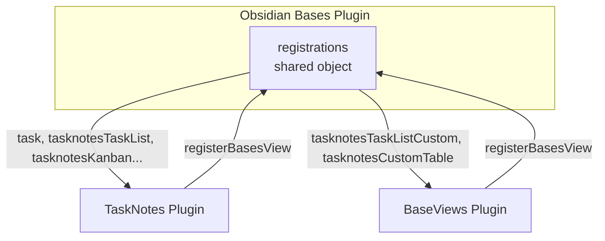
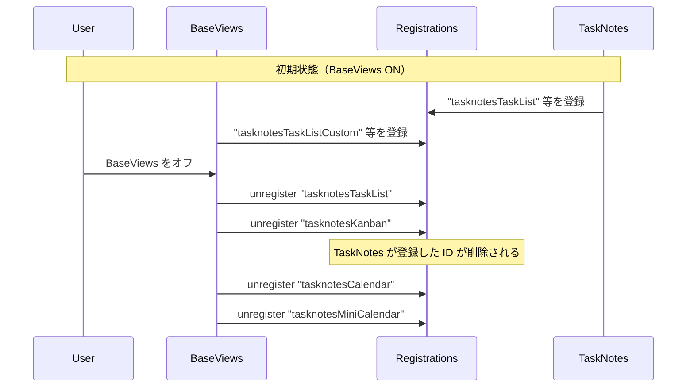

# BaseViews 解除時の Task List View 表示不良の修正計画

## 1. 問題の概要

**現象**: BaseViews をオフにすると、TaskNotes プラグインの Task List View（カスタムではなくネイティブ）が Base 上に表示されず、「Base configured with an unknown view type: tasknotesTaskList」のエラーが発生する。TaskNotes プラグインはオンなのに、Task List View が利用できなくなる。

## 2. 原因分析

### 2.1 プラグイン構成

- **BaseViews** (id: `base-views`): 別リポジトリで開発されている独立プラグイン。TaskNotes をフォークしており、Bases 向けカスタムビューを提供する。
- **TaskNotes** (id: `tasknotes`): 別プラグイン。Bases 上で Task List View、Kanban View、Calendar View 等を提供する。

### 2.2 Bases の view 登録の仕組み



- 全プラグインが同じ `basesPlugin.registrations` オブジェクトに view を登録する。
- キーは view ID（例: `task`, `tasknotesTaskList`, `tasknotesTaskListCustom`）。

### 2.3 BaseViews の登録・解除

**登録** ([registration.ts](src/bases/registration.ts) 27–97行):

- BaseViews が登録するのは **2種類のみ**:
    - `tasknotesTaskListCustom`
    - `tasknotesCustomTable`

**解除** ([registration.ts](src/bases/registration.ts) 139–153行):

```ts
export function unregisterBasesViews(plugin: TaskNotesPlugin): void {
  try {
    unregisterBasesView(plugin, "tasknotesTaskListCustom");
    unregisterBasesView(plugin, "tasknotesCustomTable");
    // Legacy IDs cleanup from former TaskNotes-fork behavior
    unregisterBasesView(plugin, "tasknotesTaskList");   // TaskNotes の登録
    unregisterBasesView(plugin, "tasknotesKanban");      // TaskNotes の登録
    unregisterBasesView(plugin, "tasknotesCalendar");    // TaskNotes の登録
    unregisterBasesView(plugin, "tasknotesMiniCalendar"); // TaskNotes の登録
  } catch (error) { ... }
}
```

`unregisterBasesView` ([api.ts](src/bases/api.ts) 211–228行) は `delete api.registrations[viewId]` で Bases の共有オブジェクトを直接変更する。

### 2.4 根本原因



- BaseViews はフォーク元の「レガシー ID の掃除」として、自分では登録していない `tasknotesTaskList`, `tasknotesKanban` 等を unregister している。
- それらは実際には **TaskNotes** が Bases に登録した view ID である。
- BaseViews の unload 時に `delete api.registrations[viewId]` が実行されると、TaskNotes の Task List View 等が registrations から消え、「unknown view type」となる。

## 3. 修正方針

**BaseViews が自分で登録した ID だけを unregister する。TaskNotes の ID は削除しない。**

- 解除対象: `tasknotesTaskListCustom`, `tasknotesCustomTable` のみ
- レガシー ID の一括 unregister を廃止: `tasknotesTaskList`, `tasknotesKanban`, `tasknotesCalendar`, `tasknotesMiniCalendar` は触らない

## 4. 修正内容

### 4.1 変更ファイル

`[src/bases/registration.ts](src/bases/registration.ts)`

### 4.2 変更内容

`unregisterBasesViews` から、レガシー ID の unregister を削除する。

**変更前**:

```ts
export function unregisterBasesViews(plugin: TaskNotesPlugin): void {
	try {
		unregisterBasesView(plugin, "tasknotesTaskListCustom");
		unregisterBasesView(plugin, "tasknotesCustomTable");

		// Legacy IDs cleanup from former TaskNotes-fork behavior
		unregisterBasesView(plugin, "tasknotesTaskList");
		unregisterBasesView(plugin, "tasknotesKanban");
		unregisterBasesView(plugin, "tasknotesCalendar");
		unregisterBasesView(plugin, "tasknotesMiniCalendar");
	} catch (error) {
		console.error("[BaseViews][Bases] Error during view unregistration:", error);
	}
}
```

**変更後**:

```ts
export function unregisterBasesViews(plugin: TaskNotesPlugin): void {
	try {
		// Unregister only views that BaseViews itself registered.
		// Do NOT unregister tasknotesTaskList, tasknotesKanban, etc. — those belong
		// to the separate TaskNotes plugin and must not be removed when BaseViews unloads.
		unregisterBasesView(plugin, "tasknotesTaskListCustom");
		unregisterBasesView(plugin, "tasknotesCustomTable");
	} catch (error) {
		console.error("[BaseViews][Bases] Error during view unregistration:", error);
	}
}
```

### 4.3 影響範囲

- `onunload` ([main.ts](src/main.ts) 55–66行) と `syncBasesFeatureBindings` (154–156行) は `unregisterBasesViews` を呼ぶだけで、呼び出し方は変更不要。
- TaskNotes が登録する view は変更されないため、BaseViews をオフにしても Task List View 等が引き続き利用可能になる。

### 4.4 テスト方針

- `tests/unit/bases/registration.unregister.test.ts` を追加し、`unregisterBasesViews` が BaseViews 自身の ID（`tasknotesTaskListCustom`, `tasknotesCustomTable`）のみを解除することを検証する。
- 旧レガシー ID（`tasknotesTaskList`, `tasknotesKanban`, `tasknotesCalendar`, `tasknotesMiniCalendar`）が解除対象に含まれないことを明示的に検証する。
- 実行コマンド: `npm test -- tests/unit/bases/registration.unregister.test.ts`

## 5. 補足事項

- BaseViews 単体では `tasknotesTaskList` 等を登録していないため、これらを unregister しても BaseViews 側の後片付けにはならない。
- フォーク元由来のレガシー ID は、現状では TaskNotes 本体が使用しており、BaseViews が掃除対象とするのは不適切。

## 6. 実施タスク

- `src/bases/registration.ts` の `unregisterBasesViews` から legacy ID の `unregister` 呼び出しを削除
- `tests/unit/bases/registration.unregister.test.ts` を追加して回帰テストを実装
- `npm test -- tests/unit/bases/registration.unregister.test.ts` を実行して検証（実行環境に `npm` が無く未実施）
- `AIdocs/LOG-20260226.md` に実装内容と判断理由を記録
- `jest.config.js` の `testMatch` を OS 非依存パターンへ修正（Windows で bases テストが拾えない問題に対応）
