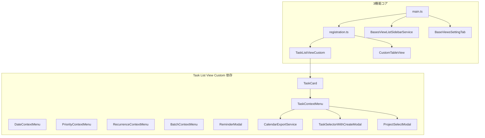

# BaseViews 不要コード削除計画

## 背景

BaseViewsはTaskNotesフォークであるが、現在の主機能は以下3つに限定されている（[IMPLEMENTATION.md](AIdocs/IMPLEMENTATION.md) 参照）:

1. **view一覧**: .baseファイルのViewを一覧表示
2. **Table View (Custom)**: 組み込みTable Viewを模したカスタムビュー
3. **Task List View (Custom)**: TaskNotes連携によるタスクカード表示（TaskNotes同時起動時フル機能、非起動時read-only）

本計画は、上記3機能に無関係なコードと開発支援機能を特定し、削除可能な対象・理由・リスクを整理する。

---

## 検証アップデート（2026-02-27, TaskNotes 4.4.0基準）

本計画のカテゴリB/オプション4は、TaskNotesの古いtagではなく **4.4.0**（stable release）を基準に再検証した。

確認済み事項:

- `openTaskCreationModal(prePopulatedValues?: Partial<TaskInfo>)` はTaskNotes 4.4.0で利用可能
- `openTaskEditModal(task, ...)` で `projects / blockedBy / blocking / subtasks` を編集可能
- `TaskInfo` は `projects / blockedBy / blocking / googleCalendarEventId` などを保持
- `applyProjectSubtaskFilter` は4.4.0では「未提供（not available）」の通知実装であり、機能維持の根拠としては使えない

BaseViews側で判明した前提不足:

- `TaskContextMenu` は `plugin.openTaskCreationModal(...)` を直接呼ぶが、BaseViewsの`main.ts`には委譲メソッドが未実装
- `TaskNotesRuntimeBridge` に `openTaskCreationModal` / `taskCalendarSyncService` が定義されておらず、委譲前提とコードが一致していない
- 「Google同期は既にruntime委譲済み」という記述は現状コードとは不一致

上記により、**オプション4は「成立可能だが、事前の橋渡し修正が必須」** と判断する。

---

## 削除対象の分類

### カテゴリA: 完全に未使用（呼び出し経路なし）

これらのコードはmain.tsから到達せず、3機能のいずれからも参照されていない。

| 対象                                                   | 理由                                                                                                                                                                                                                                                        | リスク                                                |
| ---------------------------------------------------- | --------------------------------------------------------------------------------------------------------------------------------------------------------------------------------------------------------------------------------------------------------- | -------------------------------------------------- |
| `src/utils/helpers.ts` 内の timeblock 関連関数群            | カレンダー/タイムブロック機能削除済み。`updateTimeblockInDailyNote`, `addTimeblockToDailyNote`, `removeTimeblockFromDailyNote`, `updateTimeblockTimes`, `extractTimeblocksFromNote`, `timeblockToCalendarEvent`, `validateTimeBlock`, `generateTimeblockId` はいずれも外部から呼ばれていない | 低。esbuildのtree-shakingで未到達コードは既にバンドル外の可能性あり。削除で明確化 |
| `package.json` の `obsidian-daily-notes-interface` 依存 | 上記 timeblock 関数経由でのみ使用。該当関数削除で不要になる                                                                                                                                                                                                                       | 低                                                  |
| `src/types/ical.d.ts`                                | icalモジュールの型定義。`CalendarExportService` はicalをimportせず自前でICS文字列を生成している。ical依存はなし                                                                                                                                                                            | 低。削除してもビルド影響なし                                     |

### カテゴリB: 条件付き削除（Task List View Custom のコンテキストメニュー簡素化で削除可能）

Task List View Custom のタスクカード右クリックメニューには、カレンダーエクスポート・依存関係選択・プロジェクト選択などのサブメニューがある。これらを削除すれば以下が不要になる。

| 対象                                                   | 理由                                                                                                                    | リスク                                                                                             |
| ---------------------------------------------------- | --------------------------------------------------------------------------------------------------------------------- | ----------------------------------------------------------------------------------------------- |
| `src/services/CalendarExportService.ts`              | TaskContextMenuの「Add to calendar」サブメニュー（Google/Outlook/Yahoo URL、ICSダウンロード、Google同期）からのみ使用                            | **中〜高**。TaskNotes runtime公開APIだけではURL生成/ICSダウンロードを代替しにくく、削除時は機能縮退を伴う可能性                         |
| `src/modals/TaskSelectorWithCreateModal.ts`          | 「Add blocked by」「Add blocking」「Add as subtask」メニューからのみ使用                                                              | **中**。依存関係・サブタスク割当を廃止                                                                           |
| `src/modals/ProjectSelectModal.ts`                   | 「Add to project」「Add subtasks」メニューからのみ使用                                                                              | **中**。プロジェクト組織機能を廃止                                                                             |
| `src/services/NaturalLanguageParser.ts`              | TaskSelectorWithCreateModalの「Create task」時の自然言語入力を解析するためのみ使用                                                          | 上記Modal削除で不要                                                                                    |
| `src/services/TriggerConfigService.ts`               | NaturalLanguageParserの初期化でのみ使用                                                                                        | 同上                                                                                              |
| `src/suggest/FileSuggestHelper.ts`                   | TaskSelectorWithCreateModal、ProjectSelectModalでのファイルサジェストに使用。また `FileFilterConfig` 型は `types/settings.ts` で参照         | ProjectSelectModal/TaskSelectorWithCreateModal削除時、UserMappedField.autosuggestFilter 等の型参照も整理が必要 |
| `src/utils/projectMetadataResolver.ts`               | ProjectSelectModalでのみ使用                                                                                               | 同上                                                                                              |
| `src/utils/projectAutosuggestDisplayFieldsParser.ts` | FileSuggestHelper, ProjectSelectModalで使用                                                                              | 同上                                                                                              |
| `src/utils/projectFilterUtils.ts`                    | 同上                                                                                                                    | 同上                                                                                              |
| `src/utils/dependencyUtils.ts`                       | TaskContextMenuの依存関係メニュー（blocked by / blocking）で使用。FieldMapper も normalizeDependencyEntry / serializeDependencies を使用 | **削除不能**。FieldMapper が Bases データマッピングで必須参照。Add 部分を委譲してもファイル全体は残す必要あり                            |

#### TaskNotes 委譲による削除可否評価

各項目について、TaskNotes 4.4.0 の機能を呼び出すことで自前実装を削除しつつ機能を維持できるかを評価する。

| 対象                            | 削除可能 | 削除不能 | 不明（機能維持能否） | 備考                                                                                                                                                                                                                     |
| ----------------------------- | ---- | ---- | ---------- | ---------------------------------------------------------------------------------------------------------------------------------------------------------------------------------------------------------------------- |
| `CalendarExportService`       |      | ○    |            | BaseViewsの現行機能（Google/Outlook/Yahoo URL生成 + ICSダウンロード）をruntime公開APIのみで等価代替する経路がない。削除する場合は機能縮退を許容する前提。Google同期も現状は委譲バインド不足があるため、先に橋渡し修正が必要                                                                              |
| `TaskSelectorWithCreateModal` | ○    |      |            | 「Add blocked by / blocking / subtask」→ `openTaskEditModal(task)` 委譲で代替可能。UXは専用選択UIから編集モーダルに変更。Create系は `openTaskCreationModal()` への導線に置換可能                                                                             |
| `ProjectSelectModal`          | ○    |      |            | `openTaskEditModal(task)` で projects/subtasks 編集に委譲すれば代替可能                                                                                                                                                             |
| `NaturalLanguageParser`       | ○    |      |            | TaskSelectorWithCreateModal削除時に不要。作成はTaskNotesのTaskCreationModal側NLPへ委譲                                                                                                                                                |
| `TriggerConfigService`        | ○    |      |            | NaturalLanguageParser と連動して削除可能                                                                                                                                                                                        |
| `FileSuggestHelper`           | ○    |      |            | 上記Modal削除で不要。ただし `types/settings.ts` の `FileFilterConfig` 型参照整理が前提                                                                                                                                                     |
| `projectMetadataResolver` 等   | ○    |      |            | ProjectSelectModal 削除で不要                                                                                                                                                                                               |
| `dependencyUtils`             |      | ○    |            | FieldMapper が `normalizeDependencyEntry`, `serializeDependencies` を使用。Bases データの blockedBy 正規化に必須。**ファイル全体は削除不能**。Add 部分を openTaskEditModal 委譲すれば `formatDependencyLink` 等の Add 専用関数は TaskContextMenu からは不要になるが、他関数は残置 |

**委譲による削除を採用する場合の変更例**:

- Add blocked by / Add blocking → メニュー項目を「Edit in TaskNotes」に変更し `openTaskEditModal(task)` を呼ぶ
- Add to project / Add subtasks → 同様に `openTaskEditModal(task)` へ委譲
- Create subtask → `openTaskCreationModal({ projects: [...] })` でTaskNotes側作成モーダルへ委譲
- TaskSelectorWithCreateModal / ProjectSelectModal への依存をTaskContextMenuから除去

**オプション4を成立させるための必須前提（先に実施）**:

1. `main.ts` に `openTaskCreationModal(...args)` のruntime委譲メソッドを追加
2. `TaskNotesRuntimeBridge.ts` に `openTaskCreationModal` と `taskCalendarSyncService`（必要な最小面）を追加
3. `TaskContextMenu.ts` の `plugin.openTaskCreationModal(...)` / `plugin.taskCalendarSyncService` 呼び出しを、上記委譲前提で整合化
4. `types/settings.ts` の `FileFilterConfig` 参照を切り離せるように型を移設/簡略化

**実施方針の選択肢**:

- **オプション1（保守的）**: カテゴリBは削除しない。Task List View Custom のフルコンテキストメニューを維持
- **オプション2（積極的）**: カレンダーエクスポートのみ削除（CalendarExportService + 関連i18n）。依存関係・プロジェクトはTaskNotes runtime 連携として維持
- **オプション3（最小化）**: カテゴリB全体を削除し、Task List View Custom のコンテキストメニューを「ステータス・優先度・日付・リマインダー・リカーランス・ノート操作」に限定
- **オプション4（TaskNotes委譲・条件付き成立）**: Add blocked by / blocking / project / subtask / Create を `openTaskEditModal` / `openTaskCreationModal` に委譲し、TaskSelectorWithCreateModal, ProjectSelectModal, NaturalLanguageParser, TriggerConfigService, FileSuggestHelper, projectMetadataResolver 等を削除して機能維持を狙う。**ただし前提のruntime橋渡し修正が必須**。CalendarExportService は委譲だけでの等価維持が難しいため、残置または機能縮退を明示して削除を判断する

### カテゴリC: 設定・型・i18nのスリム化

現在の `TaskNotesSettings` と `DEFAULT_SETTINGS` には、Pomodoro、カレンダー同期、ICS、HTTP API、Webhook、OAuth等の多数の未使用項目が残っている。IMPLEMENTATION.md 11.5 では「後方互換と既存参照維持のため、未使用設定項目を含んだまま」と記載。

| 対象                                                            | 理由                                                                                                | リスク                                                                              |
| ------------------------------------------------------------- | ------------------------------------------------------------------------------------------------- | -------------------------------------------------------------------------------- |
| `src/types/settings.ts` の未使用フィールド                             | Pomodoro, calendarViewSettings, icsIntegration, enableAPI, webhooks, OAuth系, commandFileMapping 等 | **中**。既存ユーザーの `loadData()` で読み込まれたデータに未定義キーがあると型エラーやマージ不整合の可能性。段階的削除＋マイグレーションが必要 |
| `src/settings/defaults.ts` の未使用デフォルト値                         | 同上                                                                                                | 同上                                                                               |
| `src/types.ts` の `TimeBlock`, `DailyNoteFrontmatter` 等        | timeblock削除時に不要になる型                                                                               | 他モジュールで参照されていないことの確認後                                                            |
| `src/i18n/resources/en.ts`, `src/i18n/resources/ja.ts` の未使用キー | views.agenda, timeblock, releaseNotes, Pomodoro, API, webhooks, calendarViewSettings 等の大規模セクション   | **低〜中**。translate() が存在しないキーを参照するとキーがそのまま返る。未使用キー削除は安全だが、漏れがあるとフォールバック表示になる      |

**実施方針**: まずは i18n の未使用キー削除から着手するのが安全。settings の型削除は後方互換マイグレーション設計後に実施。

### カテゴリD: utils/helpers.ts の部分削除

| 対象                   | 理由                          | リスク                                                                                 |
| -------------------- | --------------------------- | ----------------------------------------------------------------------------------- |
| `ensureFolderExists` | 外部から呼ばれていない（grep結果で呼び出し元なし） | **要確認**。BasesViewBase の `createFileForView` や TaskNotes runtime 連携で将来的に使う可能性。念のため確認 |
| timeblock 関連の上記関数群   | カテゴリAで記載                    | 低                                                                                   |

### カテゴリE: styles（CSS）の削除・簡素化

ビルド時、`build-css.mjs` が `styles/` 配下の CSS を `styles.css` に統合する。以下の CSS ファイルに削除・簡素化の余地がある。

| 対象                                                  | 理由                                                                                                                  | リスク                                                                                  |
| --------------------------------------------------- | ------------------------------------------------------------------------------------------------------------------- | ------------------------------------------------------------------------------------ |
| `styles/search-box.css`（約120行）                      | SearchBox コンポーネントは存在しない。Task List View Custom は `enableSearch=false` 固定で検索UIを表示しない。`tn-search-` クラスは src 内で参照されていない | **低**。即時削除可能                                                                         |
| `styles/agenda-view.css`（約551行）                     | Agenda View 本体は BaseViews に存在しない。使用されているのは `.agenda-view__item-count` のみ（TaskListViewCustom がグループ見出しの件数表示に使用）       | **低**。`agenda-view__item-count` のスタイルを `task-list-view.css` に移動後、agenda-view.css を削除 |
| `styles/task-selector-with-create-modal.css`（約325行） | TaskSelectorWithCreateModal 専用。カテゴリB（TaskSelector/ProjectSelect 削除）採用時に不要になる                                        | カテゴリB削除と連動                                                                           |

**実施手順（search-box / agenda-view）**:

1. `build-css.mjs` の `CSS_FILES` から `search-box.css` を削除
2. `agenda-view__item-count` の基本スタイル（agenda-view.css 358-374行相当）を `task-list-view.css` に移動
3. `build-css.mjs` の `CSS_FILES` から `agenda-view.css` を削除
4. `npm run build-css` で styles.css を再生成し、Task List View Custom のグループ見出し件数表示を確認

**削除しない styles**:

- `variables.css`, `utilities.css`, `base.css` - コア変数・ユーティリティ
- `task-card-bem.css` - TaskCard で使用
- `modal-bem.css`, `reminder-modal.css` - 各種モーダルで使用
- `task-list-view.css` - Task List View Custom で使用
- `bases-views.css` - view一覧・Custom Table 等で使用

### カテゴリF: 開発支援・パッケージ

| 対象                                 | 理由                                              | リスク                                        |
| ---------------------------------- | ----------------------------------------------- | ------------------------------------------ |
| `chrono-node` パッケージ                | NaturalLanguageParser でのみ使用。カテゴリB削除時に不要         | NaturalLanguageParser 削除と連動（カテゴリB オプション3時） |
| `src/types/chrono-node.d.ts`       | chrono-node 用型定義                                | 同上                                         |
| `src/locales/` の NLPLanguageConfig | NaturalLanguageParser が getLanguageConfig() で使用 | 同上                                         |
| `scripts/sync-manifest-version.js` | IMPLEMENTATION 11.9 で「残置」と記載。バージョン同期用           | 削除しない                                      |

---

## dependency グラフ（3機能の核となる部分）

---

## 推奨実施順序

### フェーズ1: リスク最小（即時実施可能）

1. `src/types/ical.d.ts` の削除 - 未使用型定義
2. `styles/search-box.css` の削除と `build-css.mjs` の更新 - 未使用CSS（約120行削減）
3. `styles/agenda-view.css` の簡素化 - `agenda-view__item-count` を task-list-view.css に移動後、agenda-view.css を削除（約540行削減）
4. `src/utils/helpers.ts` 内 timeblock 関連関数群の削除 - 未使用コード。約200行削減
5. `package.json` から `obsidian-daily-notes-interface` 削除 - timeblock削除後
6. `src/types.ts` から `TimeBlock`, `DailyNoteFrontmatter` の削除 - 他参照が無いことを確認後

実施状況（2026-02-27）:

1. 上記1〜6を実施済み
2. `package-lock.json` も手動で整合済み（`obsidian-daily-notes-interface` エントリ削除）
3. 環境制約により `npm run typecheck` / `npm run build` は未実行（このシェルで `npm` が利用不可）

### フェーズ2: ユーザー確認後に実施

1. **オプション4の事前整備** - runtime橋渡し修正（`openTaskCreationModal` / `taskCalendarSyncService`）、TaskContextMenu呼び出し整合化
2. **i18n 未使用キーの削除** - views.agenda, timeblock, releaseNotes, Pomodoro 等の大規模セクション。使用キーの網羅的grepで確認後

実施状況（2026-02-27, フェーズ2-1）:

1. `TaskNotesRuntimeBridge.ts` に `TaskCalendarSyncServiceLike`、`openTaskCreationModal`、`taskCalendarSyncService` を追加
2. `main.ts` に `openTaskCreationModal(...args)` のruntime委譲メソッドを追加
3. `main.ts` の `syncTaskNotesRuntimeBindings()` で `taskCalendarSyncService` をruntimeから同期するよう更新
4. `TaskContextMenu.ts` の `plugin.openTaskCreationModal(...)` 呼び出しは、上記委譲メソッド経由で動作する状態に整合
5. 環境制約により `npm run typecheck` / `npm run build` は未実行（このシェルで `npm` が利用不可）

### フェーズ3: 設計判断後に実施

1. **オプション3採用時** - 依存関係・プロジェクト関連メニューを廃止し、TaskSelectorWithCreateModal/ProjectSelectModal 系を一括削除
2. **オプション4採用時** - メニューをTaskNotes委譲へ置換し、TaskSelectorWithCreateModal, ProjectSelectModal, NaturalLanguageParser, TriggerConfigService, FileSuggestHelper, projectMetadataResolver 等を削除
3. **styles/task-selector-with-create-modal.css の削除** - 上記Modal削除と同時に `build-css.mjs` から除外（約325行削減）
4. **CalendarExportService の扱いを最終決定** - 残置（機能維持）か、機能縮退を明示した上で削除
5. **settings 型のスリム化** - マイグレーション設計後の段階的削除

---

## オプション4のPR分割案（実装順）

以下は、オプション4（TaskNotes委譲）を小さく安全に進めるためのPR分割案。

### PR1: runtime橋渡しを整備（前提PR）

目的:

1. BaseViews側コードが参照しているruntime APIの型/委譲を明示化する
2. オプション4の後続PRで必要な `openTaskCreationModal` を安全に呼べる状態にする

主変更ファイル:

1. `src/integrations/tasknotes/TaskNotesRuntimeBridge.ts`
2. `src/main.ts`
3. `src/components/TaskContextMenu.ts`（必要最小限の呼び出し整合）

完了条件:

1. `openTaskCreationModal` が `main.ts` からruntime委譲で呼べる
2. `taskCalendarSyncService` 参照が型上破綻しない
3. `npm run typecheck` が通る

### PR2: TaskContextMenuの「追加系」をTaskNotes編集導線へ委譲

目的:

1. `Add blocked by / Add blocking / Add to project / Add subtasks` を専用セレクタではなく TaskNotes の編集モーダル導線へ置換する
2. `TaskSelectorWithCreateModal` と `ProjectSelectModal` への依存を外す

主変更ファイル:

1. `src/components/TaskContextMenu.ts`
2. `src/i18n/resources/en.ts`
3. `src/i18n/resources/ja.ts`

完了条件:

1. 追加系メニューから `openTaskEditModal(task)` へ遷移できる
2. 既存の削除系（remove blockedBy/blocking）は動作維持
3. `TaskSelectorWithCreateModal` / `ProjectSelectModal` のimportがTaskContextMenuから消える

### PR3: Create subtask導線をTaskNotes作成モーダルへ統一

目的:

1. `Create subtask` を `openTaskCreationModal({ projects: [...] })` に一本化し、TaskNotes側作成機能へ委譲する
2. BaseViews内での重複作成導線を縮小する

主変更ファイル:

1. `src/components/TaskContextMenu.ts`
2. `src/main.ts`（PR1で未完なら補完）

完了条件:

1. 親タスクから `Create subtask` でTaskNotes作成モーダルが開く
2. projectsの事前投入が維持される
3. `npm run typecheck` が通る

### PR4: 不要モジュール削除（委譲後の本体削減）

目的:

1. PR2/PR3で参照が消えたカテゴリBモジュールを削除する
2. 参照残りを解消し、死蔵コードを除去する

主変更ファイル:

1. 削除候補: `src/modals/TaskSelectorWithCreateModal.ts`
2. 削除候補: `src/modals/ProjectSelectModal.ts`
3. 削除候補: `src/services/NaturalLanguageParser.ts`
4. 削除候補: `src/services/TriggerConfigService.ts`
5. 削除候補: `src/utils/projectMetadataResolver.ts`
6. 削除候補: `src/utils/projectAutosuggestDisplayFieldsParser.ts`
7. 削除候補: `src/utils/projectFilterUtils.ts`

完了条件:

1. 上記削除対象への参照が `rg` で残らない
2. i18nキーの未使用分を同PRまたは後続PRで整理する
3. `npm run typecheck` が通る

### PR5: FileSuggestHelperと型参照の切り離し

目的:

1. `FileSuggestHelper` 依存を完全除去する
2. `types/settings.ts` の `FileFilterConfig` 参照を独立型に置換する

主変更ファイル:

1. `src/suggest/FileSuggestHelper.ts`（削除または空参照化）
2. `src/types/settings.ts`
3. 関連するsettings/i18n/デフォルト定義

完了条件:

1. `FileFilterConfig` が `suggest/` に依存しない
2. `FileSuggestHelper` 参照がコード上に残らない
3. `npm run typecheck` が通る

### PR6: CSSとビルド定義の追従整理

目的:

1. 削除済みモーダル専用スタイルをビルド対象から外す

主変更ファイル:

1. `styles/task-selector-with-create-modal.css`（削除）
2. `build-css.mjs`

完了条件:

1. `build-css.mjs` に当該CSSの参照がない
2. `npm run build` が通る

### PR7: CalendarExportServiceの最終判断（分岐PR）

目的:

1. カレンダー機能を「維持」か「縮退して削除」かを明示的に確定する

分岐:

1. 維持案: `CalendarExportService` 残置、委譲対象外として文書化
2. 削除案: TaskContextMenuのAdd to calendarを削除し、`CalendarExportService.ts` と関連i18nを削除

実施状況（2026-03-01）:

1. **維持案を採用**（`CalendarExportService` は残置、TaskContextMenu の Add to calendar 導線も維持）
2. PLAN / IMPLEMENTATION / LOG に同方針を反映
3. `npm run typecheck` は成功。`npm run build` は実行環境の `esbuild spawn EPERM` により未完
4. 追補再検証（2026-03-01）:
  - TaskNotes **4.4.0**（`3be768a`）と最新HEAD（`3e40202`）の双方で、`Add to calendar` は `TaskContextMenu -> CalendarExportService` 直結で実装されている
  - BaseViewsがruntime経由で利用可能な導線は `openTaskEditModal` / `openTaskCreationModal` / `taskCalendarSyncService` が中心で、Google/Outlook/Yahoo URL生成やICSダウンロードの等価APIは提供されていない
  - 方針「TaskNotes呼び出しで代替できるなら削除、不可なら残置」に基づき、`CalendarExportService` 残置判断は継続

完了条件:

1. 選択した方針がPLAN/IMPLEMENTATION/LOGに一致して記録される
2. `npm run typecheck` と `npm run build` が通る

---

## フェーズ3再評価（2026-03-01 追補）

### 観点A: `.tasknotes-plugin` 依存の局所化（View一覧 / Custom Table）

調査結果:

1. View一覧と Custom Table のスタイル主対象は `styles/bases-views.css` の `.tn-bases-*` / `.tn-tasknotesCustomTable` 系であり、`.tasknotes-plugin` 直依存はない
2. BaseViews側で `.tasknotes-plugin` を付与している主箇所は `BasesViewBase.setupContainer()` のroot class（全カスタムビュー共通）
3. したがって、View一覧/Custom Tableの非依存化は「root classの付与条件分離」で達成可能

実施方針:

1. `tasknotes-plugin` クラスは `Task List View (Custom)` のみ付与
2. `tasknotesCustomTable` / View一覧導線では `tasknotes-plugin` を前提にしない
3. 変更後に `styles/bases-views.css` の見た目差分と操作性（View一覧、Table表示、行高、グループ）を確認

### 観点B: CSS最小化（Task List View Custom を TaskNotes 側へ委譲）

調査結果:

1. BaseViews同梱CSSの多くは `.tasknotes-plugin` スコープで、Task List UI向けスタイルが中心
2. TaskNotes 4.4.0 と最新HEADの `styles/*`（本計画対象ファイル群）は一致しており、委譲ベースの削減余地がある
3. ただし `styles/bases-views.css` はBaseViews独自拡張が多く、全面削除は不可

実施方針:

1. Task List専用の重複スタイルを候補化し、`bases-views.css` と分離して削減
2. Table/View一覧に必要なスタイルとトークンはBaseViews側に残す
3. `build-css.mjs` を段階的に更新し、視覚回帰がないことを確認

### 観点C: settings型スリム化（安全優先）

方針:

1. **即時削除はしない**（既存ユーザーデータ互換を優先）
2. 先に「使用中キー」と「未使用候補キー」を棚卸しし、削除候補を明示
3. 削減を実施する場合は、段階移行:
  - 保存時サニタイズ（allowlist）を導入
  - 旧キーは読み込み互換のみ維持（一定期間）
  - 実データ削除は明示マイグレーション後に限定
4. 上記設計でリスクが解消できない場合は、フェーズ3では設計確定までとして実装は見送る

実施状況（2026-03-01）:

1. `TaskNotesSettings` と `DEFAULT_SETTINGS`、`plugin.settings.*` 参照を棚卸しし、設定キーが広範囲に参照されていることを確認
2. 本リポジトリには専用の settings マイグレーションサービスが存在せず、即時削除は互換性リスクが高いと判断
3. PR10 は **設計完了（段階移行方針を確定）・フェーズ3では実装見送り** とする

---

## 削除しないもの（注意）

- **TaskNotesRuntimeBridge** - Task List View Custom の TaskNotes 連携に必須
- `**src/utils/dependencyUtils.ts` のコア関数** - FieldMapper経由で必須（ファイル全削除は不可）
- **TaskCard, TaskContextMenu, DateContextMenu 等** - Task List View Custom の中核UI
- **FieldMapper, PropertyMappingService** - Bases データと TaskInfo のマッピングに使用
- **BasesDataAdapter, BasesViewBase** - 2つのカスタムビュー共通基盤
- **locales (en/ja), I18nService** - NLP削除後も RecurrenceContextMenu 等で getLanguageConfig を使用する可能性あり。要個別確認

---

## 参照ファイル

- [AIdocs/IMPLEMENTATION.md](AIdocs/IMPLEMENTATION.md) - 実装状況、ファイル構造、10.4 削除候補（2026-02-21 実施済み）
- [src/main.ts](src/main.ts) - エントリポイント、3機能の登録
- [src/bases/registration.ts](src/bases/registration.ts) - 登録対象は tasknotesTaskListCustom, tasknotesCustomTable のみ

---

## TODOリスト（全体）

- 進捗: **17 / 17 完了**（残り 0）
- 最終更新: 2026-03-01（PR8〜PR10反映）
- フェーズ1（1〜6）を完了する
- PR1: runtime橋渡しを整備する（`openTaskCreationModal` / `taskCalendarSyncService`）
- PR0: 先行で `npm run typecheck` を通すための型エラー修正を行う
- PR2: TaskContextMenu の追加系（blocked by / blocking / project / subtasks）を `openTaskEditModal(task)` 委譲に置換する
- PR3: `Create subtask` 導線をTaskNotes作成モーダル委譲で最終確認する
- PR4: 委譲後に不要化したモジュール群（TaskSelector/ProjectSelect/NLP関連）を削除する
- PR5: `FileSuggestHelper` 依存と `FileFilterConfig` 参照を切り離す
- PR6: `styles/task-selector-with-create-modal.css` を削除し `build-css.mjs` 追従を行う
- PR7: `CalendarExportService` の維持/縮退削除を決定し、コードと文書を一致させる
- フェーズ2-2: i18n未使用キー（views.agenda / timeblock / releaseNotes / Pomodoro など）を削除する
- ドキュメント更新: `AIdocs/LOG-20260301.md` に判断理由付きで記録する
- ドキュメント更新: 必要に応じて `AIdocs/IMPLEMENTATION.md` を更新する
- 調査: TaskNotes 4.4.0/最新でフェーズ3-4（CalendarExportService委譲可否）を再検証する
- 調査: View一覧 / Table View(Custom) の `.tasknotes-plugin` 依存を特定する
- PR8: `BasesViewBase` の root class 付与条件を分離し、`.tasknotes-plugin` を Task List View(Custom) に限定する
- PR9: CSS最小化（Task List依存分の重複スタイル削減）を段階適用し、`build-css.mjs` を追従させる
- PR10: settings型スリム化の安全策（段階移行）を設計し、実施可否を確定する（設計完了・実装見送り）

---

## 2026-03-03 追加実装: 未使用settingsキー削減（ロールバック手順先行）

### 実装方針

- `BaseViewsSettings` と `DEFAULT_SETTINGS` から、現行3機能で参照されないトップレベル設定キーを削除する。
- `migrateBaseViewsSettings()` で allowlist ベースの正規化を行い、削除済み旧キーをランタイム設定から除外する。
- 互換維持として、`enableBases` と `basesViewListShowNativeToolbar`（旧キー移行）は引き続き migration で扱う。

### 変更対象（予定）

- `src/types/settings.ts`
- `src/settings/defaults.ts`
- `src/settings/migrations.ts`
- `tests/unit/services/baseViewsSettingsMigration.test.ts`

### 事前ロールバック手順

1. 直前コミットに戻す: `git restore src/types/settings.ts src/settings/defaults.ts src/settings/migrations.ts tests/unit/services/baseViewsSettingsMigration.test.ts`
2. 変更単位で戻す: 本PLAN節の「変更対象（予定）」4ファイルのみを対象に復元する。
3. 動作確認: `npm run typecheck` を再実行し、失敗が解消することを確認する。

### TODOリスト（2026-03-03 settings削減）

- 参照中settingsキーを再棚卸しし、削除対象を最終確定する
- `types/settings.ts` を現行利用キーへ縮小する
- `settings/defaults.ts` を縮小後の型に合わせて整理する
- `settings/migrations.ts` に allowlist 正規化を追加する
- migrationテストを更新する
- `npm run typecheck` と関連ユニットテストで検証する
- `AIdocs/LOG-20260303.md` と `AIdocs/IMPLEMENTATION.md` を更新する

