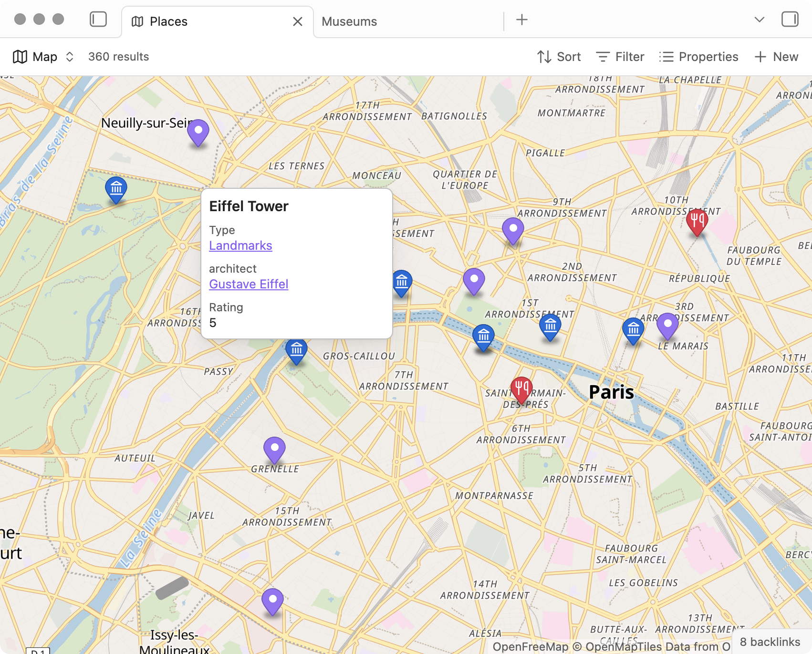

Map view

Map is a type of view you can use in Bases. It requires installing the Maps plugin.

Select lucide-map.svg > icon Map from the view menu to display files as an interactive map with markers for each file, and a preview that displays properties of that file.

bases-map-places.png > interface
Install the Maps plugin

Map views require Obsidian 1.10. The Maps plugin is an official community plugin that you can download separately.

    Follow instructions in Community plugins > Install a community plugin
    Download and enable Maps from the list

Example

To start, try creating a note called Eiffel Tower and copy the following properties into it:

---

coordinates:

- "48.85837"
- "2.294481"
  icon: "landmark"
  color: "red"
  tags:
- places

---

Here's what the code above means:
Property Value
coordinates 48.85837
2.294481 Coordinates are stored as latitude, longitude. You can get coordinates by right-clicking a location on the map and selecting Copy coordinates.
icon landmark The name of an icon from the Lucide library.
color red A valid CSS value: hex, RGB, named color, etc.
tags places The tag we'll use to find map markers in our base.

Now create a map view with a filter for the tag places and set marker coordinates, icon, and color using the properties listed above.

You can also open these example files in Obsidian to see working map views with markers, icons, and colors already configured.
Settings

Map view settings can be configured in View settings.

    Embedded height
    Center coordinates
    Zoom constraints
    Marker coordinates, color, and icon
    Background

Markers
Coordinates

To display pins on the map go to the view settings and select a marker coordinates property. The property must contain latitude and longitude coordinates. The following formats are accepted:

# Text property

coordinates: "lat, lng"

# List property

coordinates:

- "lat"
- "lng"

If you store coordinates as separate latitude and longitude properties you can combine them with a formula property by defining it as an array of coordinates using the following formula: [latitude, longitude].
Icons

Add icons to markers by defining a marker icons property. For example, you can add a property called icon to your notes and give it values like landmark or utensils from Obsidian's built-in Lucide library.
Use a formula to define icons

Let's say you want all restaurants to have the same icon on the map:

    Create a note called Restaurants and add a property called icon with the value utensils.
    Give restaurant notes a property called type that links to the [[Restaurants]] note.
    Add a formula property called Type icon to your base with the following code:

    list(type)[0].asFile().properties.icon

    Choose the Type icon as your marker icon in the view settings.

Voilà! Now your map will display icons from the the type of the place, not the place itself.
Colors

Set the color of markers. Accepts values as RGB rgb(0,0,0), HEX #000, or CSS variables like var(--color-blue). Like in the icon example above you can use a formula property to define colors dynamically.
Background
Map tiles

Map tiles are a standard way to display digital maps. There are several services you can use to customize maps with unique styles, colors, and fonts. Maps support both raster and vector tiles, and accepts most tile URLs, including TileJSON URLs.

OpenFreeMap offers a few styles you can use for free. Try using one of the following URLs in the Map tiles setting:
Name URL
Dark https://tiles.openfreemap.org/styles/dark
Positron https://tiles.openfreemap.org/styles/positron
Liberty https://tiles.openfreemap.org/styles/liberty
Useful links

    Maputnik for customizing map tiles.
    Protomaps for self-hosting map tiles.
    Other hosted services with free tiers include MapTiler and Mapbox.

Tips

You can link to popular mapping services using Formulas. For example your pin can show a link to Google Maps using the following formula:

link("https://www.google.com/maps/search/" + file.name.replace(" ","+"),"Google Maps")

Troubleshooting

If the map appears blank when you first load the Maps plugin, try updating the Obsidian installer version.

The Maps plugin is open source. You can help by contributing bug reports, feature requests and pull requests.
Links to this page
Core plugins
Introduction to Bases
Views
