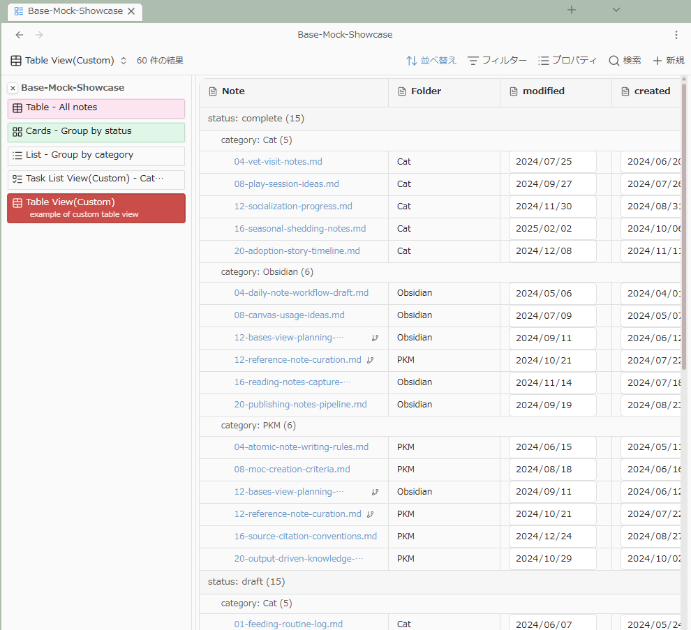

# Base Views for Obsidian (Experimental)

[日本語版 README はこちら (README.ja.md)](README.ja.md)

Base Views is an experimental plugin that enhances view operations for Obsidian `.base` files.

## Key features

This plugin is based on a fork of TaskNotes. `Table View (Custom)` and `Task List View (Custom)` extend TaskNotes' Bases custom view (Task List View).

- Always show a view list for `.base` files (this is what the plugin name "Base Views" is intended to represent).
- `Table View (Custom)`: extends the original Bases table view by adding unnest behavior for grouping on multi-value properties, and also ports TaskNotes' two-level grouping feature.
- `Task List View (Custom)`: extends TaskNotes' Task List custom view with the same unnest behavior for grouping on multi-value properties.

## Notes

- This is an experimental plugin. Behavior and settings may change in the future, and compatibility may break due to Obsidian-side changes.
- It depends on Obsidian's Bases feature.
- `Task List View (Custom)` is fully functional only when the TaskNotes plugin is installed and enabled. If you do not use TaskNotes, turning off `Task List View (Custom)` in settings is recommended.
- When you change per-base settings from the view list, some values are written into the base file's `formulas`. Also, if you set a per-view description, it is written as a `description` property in each view section (a property outside official Bases specs).

## Installation (Obsidian BRAT)

Install this plugin using Obsidian BRAT.

1. Install and enable BRAT.
2. In BRAT settings, select **Add beta plugin**.
3. Enter this repository URL: `https://github.com/iiz00/obsidian-base-views`.
4. After adding, enable **Base Views** in **Settings → Community plugins**.

## Usage

At the top of settings, you can toggle these three features. Turn off any feature you do not use.

### View list

- In `.base` files, click items in the view list to switch views.
- You can configure placement (`left` / `top` / `none` / `formulaOnly`), font size, icon visibility, and narrow-width behavior.
- This is especially useful for `.base` files with multiple views.

### Task List View (Custom)

- You can select `Task List View (Custom)` as a Bases view type.
- You can configure `Sub-group by` and `Unnest multi-value groups`.
- If TaskNotes runtime is available, editing actions are enabled.
- If TaskNotes runtime is unavailable, it is rendered as read-only.

### Table View (Custom)

- You can select `Table View (Custom)` as a Bases view type.
- You can configure row height (`Row height`), sub-grouping, and unnest.
- Supports column resizing, column summaries (`sum` / `avg` / `earliest`, etc.), and grouped display.
- If the `Iconic` plugin is installed, icons can be shown in the file name column (toggleable in settings).

## Settings (overview)

- Feature switches
    - Toggle each major feature
    - Enable view list sidebar
    - Enable Table View (Custom)
    - Enable Task List View (Custom)
- Interface language (`en` / `ja`)
- View list sidebar settings
    - Placement (`left` / `top` / `none` / `formulaOnly`), side pane placement (`left` / `top` / `none` / `formulaOnly`), font size, description visibility, icon visibility
    - Top overflow (`wrap` / `scroll`)
    - Narrow-width behavior, threshold, native toolbar visibility control
- Custom views settings
    - Show Iconic icons in `Table View (Custom)`
    - Show grouping property names

## Privacy / data handling

- Base Views features (view list display, custom view rendering, settings persistence) are designed to run locally in your Obsidian vault.
- Base Views itself does not collect, transmit, or use telemetry for user data.
- However, if you use TaskNotes runtime integration in `Task List View (Custom)`, behavior of TaskNotes-enabled features follows TaskNotes policies.

## Credits

- Based on TaskNotes: https://github.com/calluma/tasknotes
- This plugin contains modified code based on TaskNotes.

## License

- MIT
